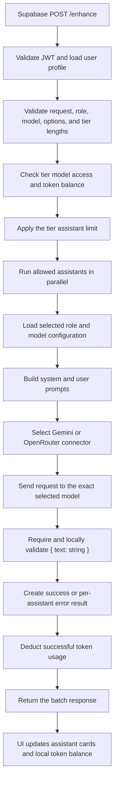
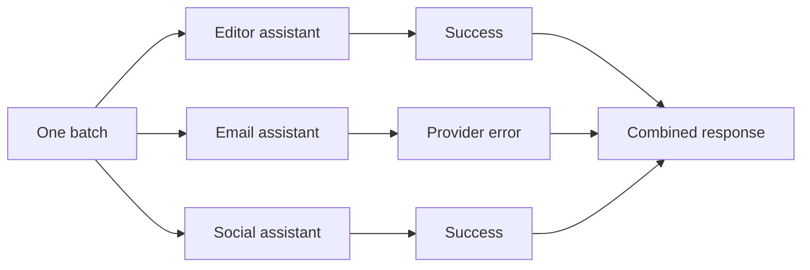

# How AI Text Enhancer Works

## The idea in one sentence

The user writes one source text, configures one or more AI assistants, and receives several purpose-specific versions of that text to compare or reuse.

An **assistant** is one saved combination of:

- a **model**: which AI service processes the request;
- a **role**: the assistant's primary job, such as editing, summarizing, writing an email, or creating a social post;
- **options**: extra changes such as shortening, tone, formality, translation, or emojis;
- an **enabled** switch: only enabled assistants run.

A **workflow** is a reusable group of assistants. Every enabled assistant receives the same source text and optional context, but uses its own role, model, and options.

## User flow

```mermaid
flowchart LR
    U["User writes source text"] --> W["Select or create a workflow"]
    W --> A["Configure assistants"]
    A --> C["Choose model, role, and options"]
    C --> S["Save configuration locally"]
    S --> E["Click Enhance"]
    E --> B["UI sends one batch request"]
    B --> R["Backend runs enabled assistants in parallel"]
    R --> V["UI shows one result per assistant"]
```



1. The user enters the main text and, optionally, reference context.
2. The user selects a saved workflow or creates a new one.
3. For each assistant, the user selects a model, role, actions, style, and output language.
4. Saving updates the current workflow in browser `localStorage`.
5. Clicking **Enhance** filters out disabled assistants and creates one batch request.
6. The UI maintains an invisible anonymous Supabase session, adds its access token, and sends `POST /enhance`.
7. Results are matched back to assistant cards by assistant ID.

The UI implementation is mainly in [the assistant page](../ui/src/app/text-ai-assistants/page.tsx), [the configuration panel](../ui/src/components/features/ConfigEditorModal.tsx), and [WorkflowContext](../ui/src/context/WorkflowContext.tsx).

## What the UI sends

```json
{
  "assistants": [
    {
      "id": "1",
      "model": "gemini-flash",
      "aiRoleId": "email_assistant",
      "userText": "Ask Dana to send the report by Tuesday.",
      "contextText": "Dana already prepared the first draft.",
      "options": {
        "improve": true,
        "fixMistakes": true,
        "format": true,
        "formality": "Formal",
        "tone": "Polite",
        "languageLevel": "default"
      }
    }
  ]
}
```

Adding another enabled assistant adds another item to `assistants`. It does not change the request or response contract.

## Backend flow



### 1. Anonymous session boundary

The public UI has no login or account controls. It creates and refreshes a
Supabase anonymous session in the background. The Edge Function starts the
services in [index.ts](../backend/supabase/functions/enhance/index.ts). The
request handler in [handler.ts](../backend/supabase/functions/enhance/handler.ts)
parses JSON, validates the anonymous Bearer token, loads the usage profile,
and passes the body to the orchestrator.

### 2. Validation and access checks

[request-validator.ts](../backend/src/services/request-validator.ts) rejects malformed objects, duplicate IDs, unknown fields, unsupported models or roles, invalid option values, conflicting `shorten` and `lengthen`, and text that exceeds the user's tier limits.

The orchestrator then checks the user's token balance and model access. Assistants beyond the tier's batch limit receive their own `TIER_BATCH_SIZE_EXCEEDED` result.

### 3. Prompt construction

For every allowed assistant, [PromptBuilder](../backend/src/services/prompt-builder.ts) combines two parts:

```text
SYSTEM PROMPT = detailed selected role + shared safety/output policy

USER PROMPT = requested transformations
            + JSON data containing reference context and source text
```

The detailed role comes from [roles.config.ts](../backend/src/config/roles.config.ts). It defines the primary job. For example, the email role must always produce a complete email.

[prompt-templates.ts](../backend/src/services/prompt-templates.ts) adds only the selected transformations. An option can change a role default, but it cannot remove output required by that role. Context and source are JSON-serialized and treated as untrusted data, not as instructions.

### 4. Model call and structured output

[models.config.ts](../backend/src/config/models.config.ts) maps the public model selected by the user to its provider model ID and structured-output capability. Selection is manual: there is currently no automatic routing or silent model replacement.

The matching provider connector sends the prompts, enforces its timeout, and requests JSON output. Gemini uses its native schema. OpenRouter uses strict JSON Schema only when the model metadata enables it; otherwise it uses JSON mode.

[output-contract.config.ts](../backend/src/config/output-contract.config.ts) defines the shared response shape and validates the provider response again locally:

```json
{ "text": "The completed enhanced text" }
```

Missing, malformed, empty, or additional output fields become an `LLM_ERROR` for that assistant.

### 5. Batch response

[BatchOrchestrator](../backend/src/services/batch-orchestrator.ts) uses `Promise.allSettled`, so one provider failure does not discard other assistant results.



Successful results contain `enhancedText` and `total_tokens`. Failed assistants contain an error code. After successful calls, the backend deducts actual reported token usage; the UI also updates the visible balance locally.

## Configuration ownership

| Concern | Main source |
|---|---|
| UI choices and default workflows | [ui/src/lib/constants.ts](../ui/src/lib/constants.ts) |
| Public request and response types | [backend/src/types/api.types.ts](../backend/src/types/api.types.ts) |
| Runtime request validation | [backend/src/services/request-validator.ts](../backend/src/services/request-validator.ts) |
| Production models and capabilities | [backend/src/config/models.config.ts](../backend/src/config/models.config.ts) |
| Detailed role behavior | [backend/src/config/roles.config.ts](../backend/src/config/roles.config.ts) |
| Tone, language, and option enums | [backend/src/config/transformation-options.config.ts](../backend/src/config/transformation-options.config.ts) |
| Tier limits | [backend/src/config/tier-limits.config.ts](../backend/src/config/tier-limits.config.ts) |
| UI/backend parity guard | [ui/__tests__/unit/config-parity.test.ts](../ui/__tests__/unit/config-parity.test.ts) |
| Prompt evaluation command | [backend/scripts/evaluate-prompts.ts](../backend/scripts/evaluate-prompts.ts) |

The backend configuration is authoritative for API processing. The UI mirrors the user-visible values, and the parity test fails if those values drift apart.

## Error behavior in simple terms

- Bad request configuration: the whole request stops with HTTP `400` before any model call.
- Missing or expired anonymous session: HTTP `401`; the UI replaces the session and reloads.
- Model not allowed for the user's tier: HTTP `403`.
- Insufficient token balance: HTTP `429`.
- One model call fails or times out: that assistant gets an error while the others can still succeed.
- The user clicks Cancel: the browser request and loading state stop; server-side model work may already be running.
